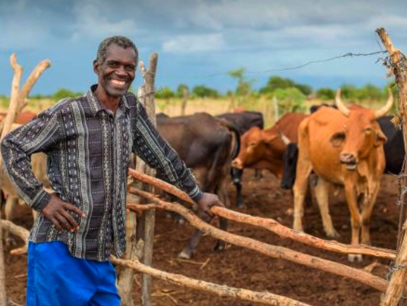
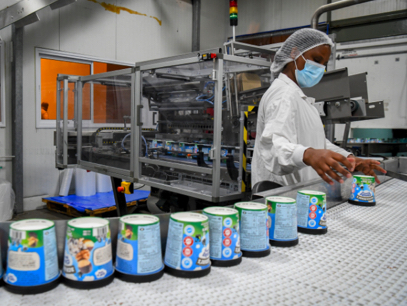
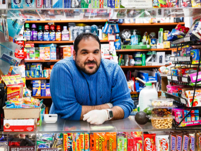
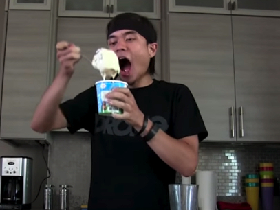
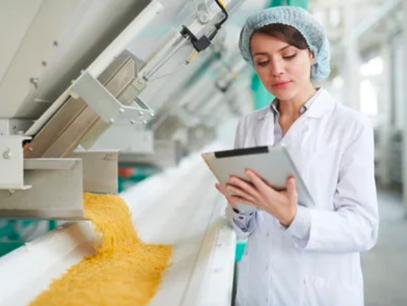

# Personas

In order to abstract away from specific use cases and
implementation details, we will use terms from the story
of *Glen and Larry’s Ice Cream Company*.

Each of these personas describes those involved in the
ice cream supply chain, and has a relevant parallel
relating to OCI and the surrounding software ecosystem.

## 1. The Dairy Farmer

The people who provide the raw ingredients used to make
the ice cream

Real-world parallel:

- Open source project maintainers

## 2. The Ice Cream Factory Worker

The people who produce the ice cream and are responsible
for its contents

Real-world parallel:

- Development teams building custom software components

## 3. The Refrigerated Truck Driver

The people responsible for safely delivering ice cream from
the factory to the purchaser

Real-world parallel:

- Hosted OCI registry vendors

## 4. The Bodega Owner

The people who receive the ice cream from the truck driver
and place it on their shelves

Real-world parallel:

- Production environments
- Kubernetes admission controllers

## 5. The Ice Cream Lover

The people who actually purchase and consume the ice cream

Real-world parallel:

- End-users of the software product

## 6. The Health Inspector

The people who make sure that the ice cream is safe to eat
at various stages in the process

Real-world parallel:

- Security teams
- Auditors
